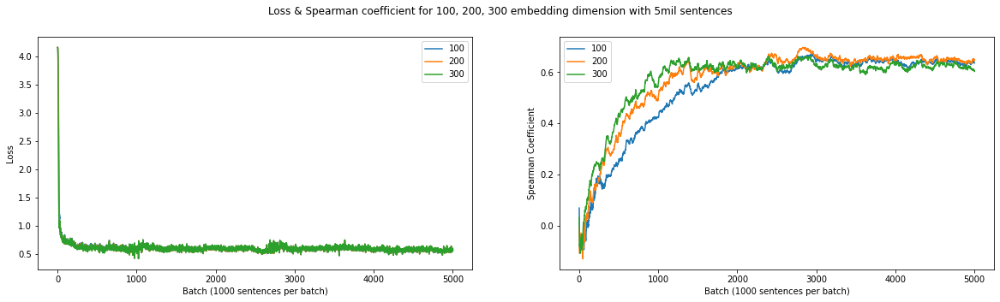
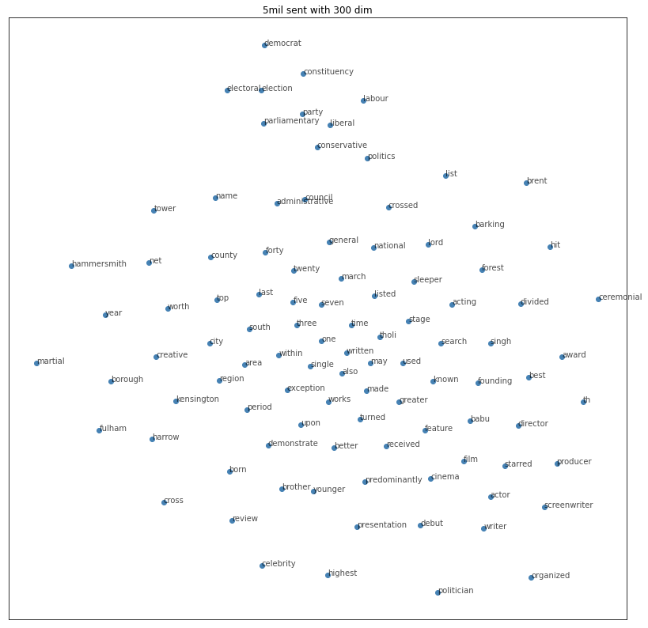

# word2vec-pytorch

Pytorch implementation of word embedding models

Following models are implemented

- Word2vec skipgram
- GloVe

## Training result

## References

- [Efficient Estimation of Word Representations in Vector Space](https://arxiv.org/abs/1301.3781)

- [Distributed Representations of Words and Phrases and their Compositionality](https://arxiv.org/abs/1310.4546)

- [GloVe: Global Vectors for Word Representation](https://www.aclweb.org/anthology/D14-1162/)
